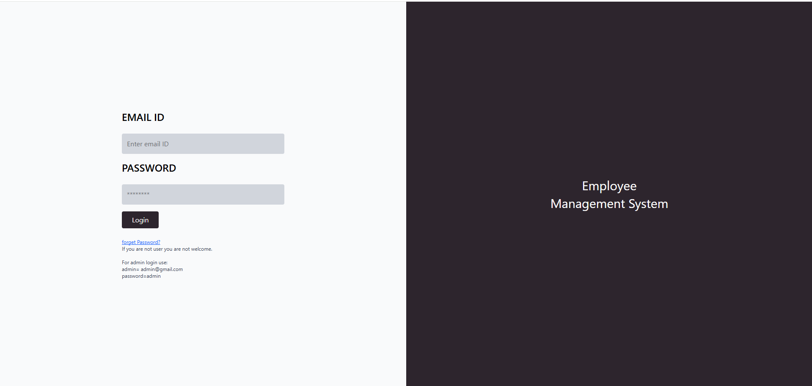
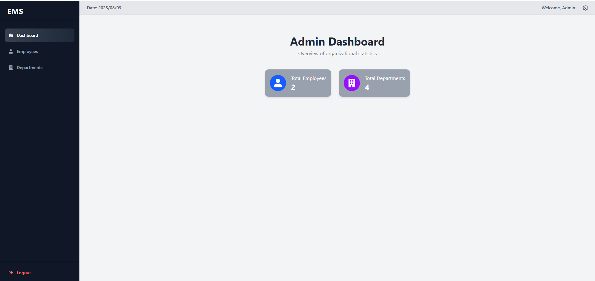
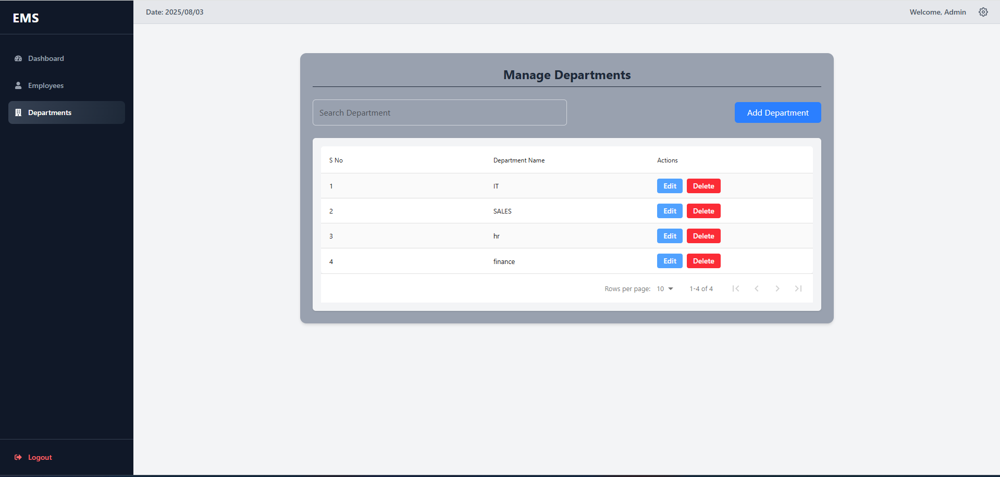
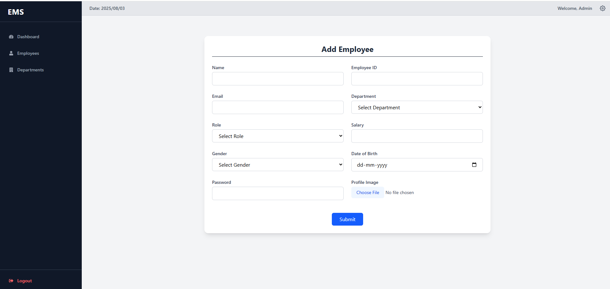
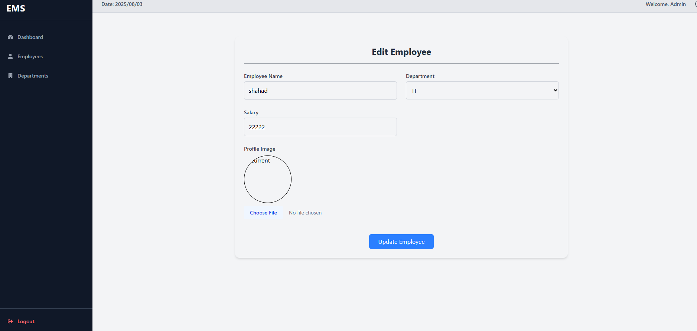
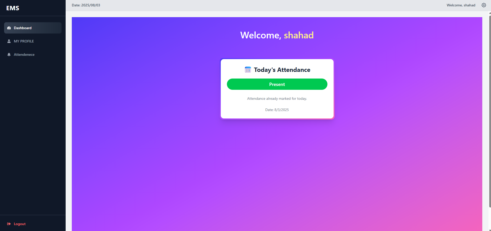

# 🚀 Employee Management System (EMS)  
### MERN Stack Application | Hosted on Vercel

[👉 **Live Demo**](https://ems-frontend-sandy.vercel.app/login)  
https://ems-frontend-sandy.vercel.app/login

---

## 📋 Project Description

**Employee Management System (EMS)** is a full-stack web application built with the **MERN stack** (MongoDB, Express.js, React.js, Node.js).  
It allows administrators to manage employees, departments, and users, while users can manage their attendance and view history.

This project was developed to demonstrate a real-world use case of **role-based access** in a web application:

✅ Admin has full CRUD capabilities  
✅ Users have restricted access to their own features  

> **Deployed and hosted on Vercel for live usage.**

---

## ✨ Key Features

### 🏛 Admin Panel

**🔐 Admin Login Credentials (Highlight this!):**

> **🆔 Email:** `admin@gmail.com`  
> **🔑 Password:** `admin`

#### Admin Can:

✔️ **Employee Management**
- ➕ Add new employees
- 🔍 Search employees
- ✏️ Edit employee details
- 👁️ View employee details
- 🗑️ Delete employees

✔️ **Department Management**
- ➕ Add new departments
- 🔍 Search departments
- 👁️ View department details
- 🗑️ Delete departments

✔️ **User Management**
- 👤 **ONLY ADMIN CAN CREATE AND DELETE USERS**  
*(Users cannot self-register or delete other users.)*

---

### 🙋 User Panel

**🔐 User Login Credentials (Highlight this!):**

> **🆔 Email:** `user@gmail.com`  
> **🔑 Password:** `123`

#### User Can:

✔️ **Attendance Management**
- ➕ Add attendance
- 📅 View attendance history
- 👁️ View personal details

---

## 🖼️ Application Screenshots

### 📍 Admin Side

#### 🗝️ Admin Login


#### 📊 Admin Dashboard


#### 🏛 Department Details


#### 📂 Employee Details


#### ➕ Add Employee


#### ✏️ Edit Employee


---

### 📍 User Side

#### 👤 User Dashboard


#### 📅 Attendance & User Details


---

## ⚙️ Technology Stack

### Frontend
- ⚛️ React.js
- tailwind css

### Backend
- 🟢 Node.js
- ⚡ Express.js
- 🔵 MongoDB (Database)

### Deployment
- 🌍 Vercel

---

## 🚀 Getting Started - Run Locally

### 1️⃣ Clone the Repository

```bash
git clone https://github.com/yourusername/your-repo.git
cd your-repo
